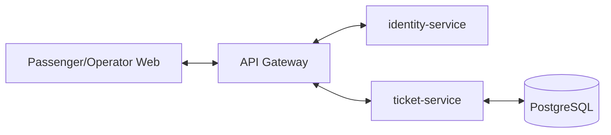
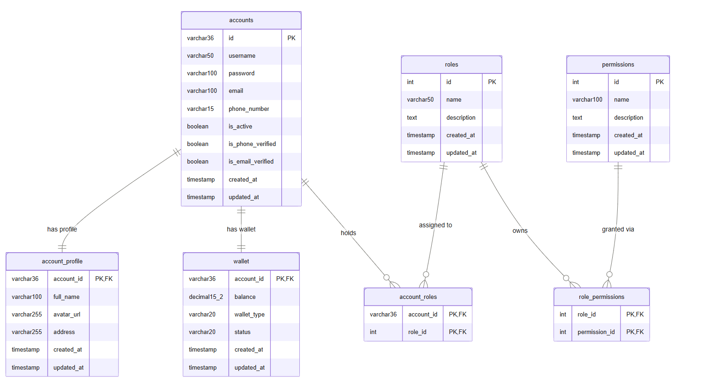
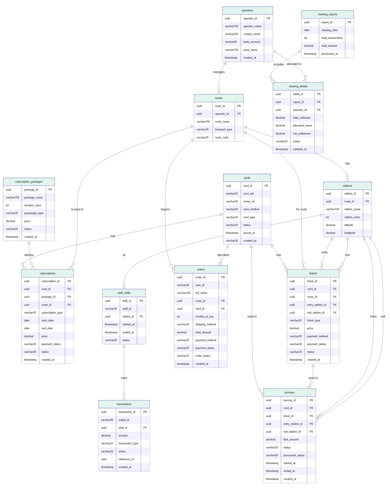
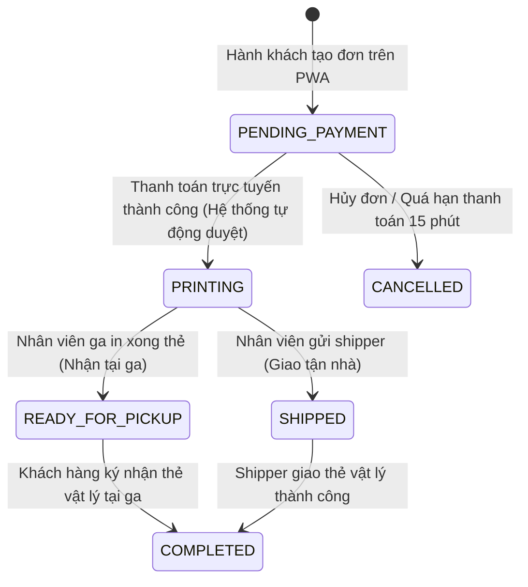
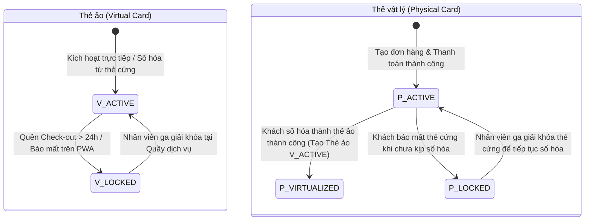
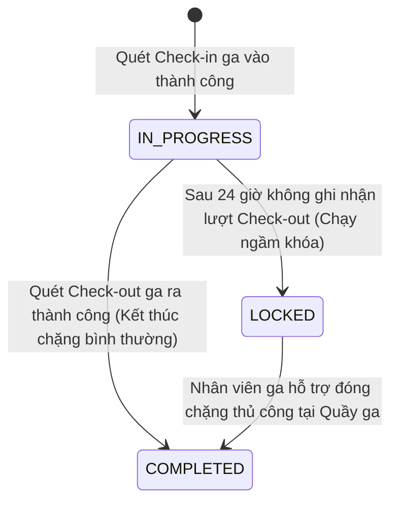
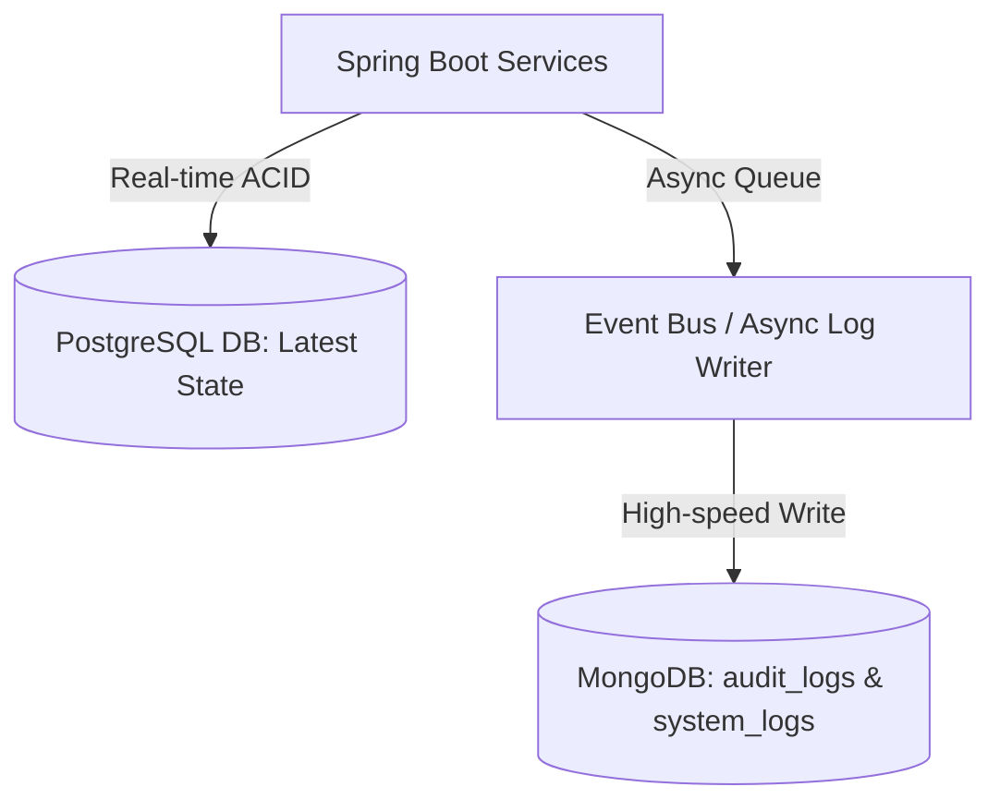

# TÀI LIỆU ĐẶC TẢ YÊU CẦU PHẦN MỀM (SOFTWARE REQUIREMENTS SPECIFICATION - SRS)
**Dự án:** Hệ thống Quản lý Vé tháng Giao thông Công cộng tự động (Period-based Fare Collection - PFC)  
**Mô hình áp dụng:** Period-Pass Subscription & Multi-tenant (Đa đơn vị vận hành liên thông)  
**Thời gian thực hiện:** 6 tuần  
**Tên tài liệu:** SRS_MetroTicket

---

## 1. GIỚI THIỆU TỔNG QUAN (INTRODUCTION)

### 1.1. Mục đích (Purpose)
Tài liệu SRS này đặc tả chi tiết toàn bộ các yêu cầu chức năng, yêu cầu phi chức năng, kiến trúc dữ liệu và giải thuật vận hành cho hệ thống quản lý và soát vé tự động liên thông Bus & Metro.

### 1.2. Phạm vi dự án (Scope)
Hệ thống PFC được thiết kế theo mô hình **Thu soát vé tự động (Automated Fare Collection - AFC)** kết hợp giữa **Vé tháng/Vé chu kỳ trả trước (Period Passes & Subscriptions)** và **Vé chặng lẻ dùng 1 lần (Single-Journey Tickets)** được thanh toán mua trước qua Ví điện tử hoặc bằng Tiền mặt/Banking tại chỗ. Hệ thống đồng thời tích hợp hạ tầng **Ví điện tử nội bộ đa đối tượng (Multi-user Wallet Ledger)** để quản lý dòng tiền liên thông tối ưu cho các nhóm đối tượng:
1.  **Hành khách (Passengers / Commuters)**: Đăng ký và đăng nhập cực kỳ tinh gọn bằng **Số điện thoại nhận mã OTP** (không mật khẩu) trên Web App (PWA). Họ sở hữu Ví điện tử cá nhân (`Passenger Wallet`) được nạp tiền sẵn trước ở nhà hoặc tại quầy (Pre-funded) để tự động thanh toán mua trước các gói Vé chặng lẻ ảo (Virtual Single-Journey Tickets) hiển thị dưới dạng mã QR động hoặc mua/gia hạn các chu kỳ vé tháng/vé dài hạn trực tuyến trên PWA di động trước khi di chuyển. Trải nghiệm được tối giản tối đa nhờ cơ chế trì hoãn hoàn thiện hồ sơ. Khi quét mã QR tại Gate/Validator, hệ thống chỉ kiểm tra chiếc Vé hoặc Subscription hợp lệ còn hiệu lực để cho qua ga, hoàn toàn không truy vấn số dư hay thực hiện trừ tiền ví của khách tại thời điểm soát vé. Tuyệt đối không thực hiện nạp tiền mặt hay giao dịch thủ công trực tiếp tại Validator trên xe/ở cổng.
2.  **Đơn vị vận hành (Operators - Company Managers)**: Mỗi công ty vận hành tuyến có một Ví doanh nghiệp (`Operator Wallet`) trên hệ thống. Dòng tiền thu trước từ vé tháng và doanh thu vé lượt được Platform thu hộ vào quỹ chung. Hằng đêm, tiến trình chạy ngầm đối soát sẽ tự động phân bổ nguồn thu này theo tỉ lệ sản lượng lượt đi thực tế và **cộng tiền đối soát (Credit)** trực tiếp vào Ví doanh nghiệp của từng công ty. Quản lý công ty có thể theo dõi biến động số dư và thực hiện lệnh **Rút tiền quyết toán (Withdraw)** về tài khoản ngân hàng thực tế của doanh nghiệp.
3.  **Quản trị nền tảng (Platform Manager)**: Giám sát toàn bộ dòng tiền luân chuyển giữa Quỹ tổng hệ thống, Ví khách hàng và Ví doanh nghiệp của các đơn vị thành viên thông qua sổ cái giao dịch tập trung (`transactions`), đảm bảo đối soát chính xác 100%, không xảy ra thất thoát.

Hệ thống bao gồm Web Hành khách (PWA), Validator Gate giả lập quét thẻ, Cổng quản trị vận hành Portal quản lý in ấn thẻ cứng và quản lý ví doanh nghiệp quyết toán.

### 1.3. Định nghĩa & Thuật ngữ (Definitions & Acronyms)
*   **PFC (Period-based Fare Collection):** Hệ thống thu phí và soát vé dựa trên vé chu kỳ/vé tháng.
*   **Single-Journey Ticket (Vé chặng lẻ dùng 1 lần):** Vé lượt đi một lần dạng điện tử QR, được mua và thanh toán trước bằng ví hoặc tiền mặt/banking. Cổng soát vé chỉ kiểm tra trạng thái vé (`ACTIVE` -> `IN_PROGRESS` -> `USED`), không kết nối ví hành khách để trừ tiền tại chỗ.
*   **Period Pass / Subscription (Vé chu kỳ/Vé tháng):** Gói cước vé dài hạn Metro/Bus, đi lại không giới hạn trên các tuyến đã đăng ký trong thời hạn mua (ví dụ: chu kỳ 1 ngày, 1 tuần, 1 tháng đến 12 tháng).
*   **Passenger Wallet (Ví hành khách):** Ví điện tử nội bộ liên kết với tài khoản khách hàng để nạp tiền trước và thanh toán mua/gia hạn vé tháng hoặc thanh toán trước các vé chặng lẻ trên ứng dụng.
*   **Operator Wallet (Ví doanh nghiệp):** Ví tài khoản của công ty vận hành để nhận tiền phân bổ doanh thu đối soát hằng ngày và yêu cầu quyết toán.
*   **Ledger Transactions (Sổ cái giao dịch):** Nhật ký biến động số dư ví (nạp, mua vé, cộng đối soát, rút tiền) phục vụ kiểm toán tài chính.
*   **Physical Card (Thẻ vật lý):** Thẻ cứng RFID in thông tin và ảnh chân dung của hành khách. Trong dự án này, thẻ vật lý được tự động khởi tạo trên hệ thống ngay khi khách thanh toán thành công, tự động cấp mã định danh `card_uid` hiển thị trên PWA và gửi qua email cho khách. Nhân viên quầy ga chỉ đảm nhận việc in ấn cơ học, cập nhật trạng thái giao nhận đơn hàng trên Portal (`PRINTING` -> `READY_FOR_PICKUP` / `SHIPPED` -> `COMPLETED`). Thẻ vật lý không tham gia trực tiếp vào luồng quét giả lập tại Gate.
*   **Virtual Card (Thẻ điện tử / Thẻ ảo):** Thẻ số hóa tích hợp trên PWA/App di động hiển thị qua Dynamic QR Code. Đây là phương tiện thanh toán chính tham gia trực tiếp vào luồng quét giả lập trên Gate Simulator (Webcam QR Reader).
*   **Physical-to-Virtual Card Migration (Số hóa thẻ vật lý):** Cơ chế số hóa thẻ vật lý cứng thành thẻ ảo trên App, tự động di trú toàn bộ các gói vé tháng còn hiệu lực từ thẻ cứng cũ sang thẻ ảo mới và chuyển trạng thái thẻ cứng cũ thành `VIRTUALIZED` (trạng thái vô hiệu hóa vĩnh viễn thẻ cứng vật lý trên hệ thống để đánh dấu đã số hóa thành công) trên cơ sở dữ liệu.
*   **Virtual Single-Journey Ticket (Vé lượt ảo / QR dùng 1 lần):** Vé chặng lẻ dùng một lần dưới dạng mã QR động hiển thị trên Web App PWA của hành khách, được thanh toán mua trước trực tuyến qua Ví Passenger Wallet hoặc OnePay.
*   **Physical-to-Virtual Card Conversion (Chuyển đổi/Số hóa Thẻ cứng):** Quy trình hành khách đăng ký mua thẻ vật lý cứng trực tuyến. Ngay sau khi thanh toán thành công, hệ thống tự động cấp mã số thẻ `card_uid` gửi qua email và hiển thị trong Lịch sử mua hàng của PWA. Hành khách có thể chủ động **số hóa thành Thẻ ảo trên PWA** ngay lập tức để di chuyển bằng Dynamic QR, hoàn toàn không cần chờ đợi nhận thẻ cứng thực tế.
*   **Validator Gate Simulator (Webcam QR Reader):** Trang web giả lập cổng soát vé hoạt động dưới dạng phần mềm, sử dụng camera máy tính (Webcam) làm đầu đọc quét mã QR động sinh ra trên điện thoại của khách hàng để mô phỏng quy trình Check-in và Check-out.
*   **PWA (Progressive Web App):** Ứng dụng Web tự phục vụ trên điện thoại di động của hành khách, đóng vai trò là chiếc thẻ ảo đa năng để mua vé tháng, mua vé lượt lẻ và hiển thị Dynamic QR Code quét khi đi tàu/bus.

---

## 2. MÔ TẢ TỔNG QUÁT (GENERAL DESCRIPTION)

### 2.1. Kiến trúc hệ thống tổng quát
Hệ thống được tổ chức theo mô hình Microservices phân tách nghiệp vụ rõ ràng, trong đó hai dịch vụ cốt lõi là:
1.  **`identity-service`:** Quản lý tài khoản hành khách và đối tác, thông tin hồ sơ cá nhân (`account_profile`), và hệ thống Ví điện tử trung tâm (`wallet`) đa đối tượng liên kết 1-1 với tài khoản.
2.  **`ticket-service` (Java Spring Boot):** Quản lý phôi thẻ, đơn đăng ký làm thẻ cứng trực tuyến (`orders`), quản lý các gói vé tháng (`subscriptions`), nhật ký lượt đi (`journeys`), soát vé Validator (kiểm tra hạn dùng vé tháng), tích hợp thanh toán OnePay, biến động số dư và Clearing Scheduler chạy ngầm đối soát doanh thu phân bổ vào ví doanh nghiệp.



### 2.2. Kế hoạch triển khai 6 tuần
*   **Tuần 1:** Tài liệu nghiệp vụ (SRS), sơ đồ Sequence Diagram, thiết kế cơ sở dữ liệu (ERD) hỗ trợ quản lý ví điện tử, đơn hàng vé tháng và đăng ký thẻ trực tuyến.
*   **Tuần 2:** Đặc tả Swagger API và cài đặt Base Code Spring Boot `ticket-service`, tích hợp cổng thanh toán Sandbox (OnePay), tạo luồng nạp tiền ví và mua vé tháng từ ví.
*   **Tuần 3:** Phát triển UI App Hành khách (Mobile-First) cho phép nạp tiền ví, đăng ký thẻ cứng (ship tận nhà), kích hoạt thẻ ảo QR Code động, thanh toán mua vé tháng bằng ví hoặc ngân hàng.
*   **Tuần 4:** Hiện thực hóa API Check-in/Check-out tại Gate Validator (Kiểm tra thời hạn hiệu lực vé tháng còn hạn, ghi nhận lượt đi).
*   **Tuần 5:** Phát triển Scheduler chạy ngầm đối soát doanh thu quỹ tổng và tự động cộng tiền phân bổ đối soát vào ví doanh nghiệp của các đơn vị thành viên, mở cổng Yêu cầu rút tiền quyết toán.
*   **Tuần 6:** Hoàn thiện báo cáo kỹ thuật ($\le 30$ trang) và slide thuyết trình ($\le 20$ slide).

---

## 3. ĐẶC TẢ CHI TIẾT CÁC YÊU CẦU CHỨC NĂNG (FUNCTIONAL REQUIREMENTS SPECIFICATION)

### 3.1. Phân Hệ Quản Trị Hệ Thống (System Admin & Operators)
Phân hệ dành cho `ADMIN`, `PLATFORM_MANAGER`, và `COMPANY_MANAGER` quản lý vận hành toàn mạng lưới, theo dõi số dư ví doanh nghiệp, phê duyệt lệnh rút tiền, cập nhật trạng thái in thẻ trên Portal và xem báo cáo.

| STT | Nhóm chức năng chính | Tính năng chi tiết | Mô tả xử lý Backend & Ràng buộc nghiệp vụ |
| :--- | :--- | :--- | :--- |
| **1.1** | Quản lý người dùng nhân viên vận hành & ca kíp | Xác thực tài khoản nội bộ (Login/Logout) | Quản trị viên và nhân viên vận hành đăng nhập vào hệ thống bằng tài khoản được cấp sẵn. Không cung cấp tính năng Đăng ký (Register) công khai để đảm bảo an toàn hệ thống. |
| **1.2** | | Quản lý tài khoản nhân viên | Admin cấp cao thực hiện các thao tác thêm mới (cấp tài khoản), cập nhật thông tin hoặc tạm khóa tài khoản của các nhân viên trực quầy/nhân viên soát vé. |
| **1.3** | | Quản lý phân ca kíp | Thiết lập và gán nhân viên vào các ca trực cụ thể (`shift_id`). Hệ thống tự động đính kèm mã ca trực vào các nhật ký tác vụ do nhân viên đó thực hiện để đối chiếu trách nhiệm khi xảy ra sự cố. |
| **1.4** | Quản lý in ấn thẻ cứng | Danh sách đơn hàng in thẻ cứng | Nhân viên trực quầy hiển thị danh sách các đơn đăng ký thẻ cứng từ hành khách đã thanh toán trực tuyến thành công (hệ thống tự động duyệt và chuyển trạng thái đơn hàng sang `PRINTING`). Hệ thống cho phép lọc theo trạng thái: Chờ in, Đang in, Đã giao. |
| **1.5** | | In thẻ & Cập nhật tiến độ | Nhân viên trực quầy xem danh sách đơn hàng `PRINTING`, tiến hành in ấn thẻ cứng vật lý bên ngoài thực tế, và nhấn nút "Xác nhận đã in" trên Portal để hệ thống tự động cập nhật trạng thái đơn hàng (`order_status`) sang `READY_FOR_PICKUP` (chờ nhận tại ga) hoặc `SHIPPED` (đã giao vận chuyển). Hệ thống hoàn toàn không cần tích hợp đầu đọc RFID hay thiết bị in phần cứng tại khâu này. |
| **1.6** | | Bàn giao & Hoàn tất đơn hàng | Nhân viên quầy bàn giao thẻ cứng vật lý cho hành khách (hoặc bàn giao cho shipper), cập nhật trạng thái đơn hàng thành `COMPLETED` để đóng đơn hàng. Hệ thống tự động gửi email thông báo mã vận đơn hoặc mã nhận thẻ tương ứng cho khách hàng. |
| **1.7** | Quản lý phát hành thẻ vé (Nội bộ) | Thêm mới phôi thẻ | Khởi tạo các phôi thẻ vé mới vào cơ sở dữ liệu hệ thống, cấp phát một mã định danh duy nhất (UUID/Card_ID) cho từng thẻ trước khi đưa ra thị trường. |
| **1.8** | | Thu hồi và khóa thẻ | Chuyển đổi trạng thái thẻ thành vô hiệu hóa (`EXPIRED` hoặc `LOCKED`) đối với các thẻ bị lỗi, thẻ hỏng cần thu hồi hoặc các thẻ bị báo mất từ hành khách. |
| **1.9** | Quản lý ví doanh nghiệp & quyết toán (Company Manager) | Tra cứu số dư & Sổ cái giao dịch ví | Cho phép Quản lý công ty vận hành (`COMPANY_MANAGER`) xem số dư khả dụng hiện tại trong Ví doanh nghiệp của mình và lịch sử cộng tiền đối soát tự động hàng đêm từ hệ thống. |
| **1.10**| | Gửi yêu cầu rút tiền quyết toán (Withdraw) | Company Manager tạo yêu cầu rút tiền từ Ví doanh nghiệp về tài khoản ngân hàng thực tế của công ty. Yêu cầu này được gửi đến `PLATFORM_MANAGER` phê duyệt. Số tiền rút sẽ bị trừ tạm thời khỏi ví khả dụng và bọc trong trạng thái `PENDING_SETTLEMENT`. |
| **1.11**| Duyệt quyết toán dòng tiền (Platform Manager) | Phê duyệt lệnh rút tiền của các công ty | `PLATFORM_MANAGER` kiểm tra tính hợp lệ của lệnh rút tiền, thực hiện chuyển khoản thực tế qua ngân hàng, sau đó nhấn "Phê duyệt" trên Portal để chính thức chuyển trạng thái giao dịch ví thành `SUCCESS` và khấu trừ vĩnh viễn số dư. |
| **1.12**| Quản lý biểu giá & phân chia đối soát | Cấu hình biểu giá vé tháng & vé chu kỳ | Cấu hình các gói vé dài hạn Metro (vé ngày: 40k, vé tuần: 160k, vé tháng từ 1 đến 12 tháng theo biểu giá Nhổn - Ga Hà Nội 2025). Loại bỏ phân loại đối tượng ưu tiên để đơn giản hóa quy trình đăng ký xác minh. |
| **1.13**| | Tính toán bù trừ & phân chia | Chạy tiến trình tổng hợp nguồn thu quỹ vé tháng, tự động tính số tiền thực nhận của từng công ty theo sản lượng lượt đi và tự động thực hiện lệnh **Cộng tiền đối soát (`CREDIT_CLEARING`)** trực tiếp vào Ví doanh nghiệp của công ty đó. |
| **1.14**| Quản lý Quầy dịch vụ ga (Passenger Service Center) | Tra cứu sự cố Vé/Thẻ | Nhân viên trực ca quét mã QR của khách bị lỗi rào chắn để tra cứu thông tin ga vào, ga ra đăng ký, lịch sử chuyến đi `IN_PROGRESS` và lý do lỗi (ví dụ: đi quá ga, quên check-out chặng trước). |
| **1.15**| | Bù cự ly trạm (Fare Adjustment) | Khi khách đi quá ga hoặc sai cự ly đã thanh toán, hệ thống tự động tính số tiền cần bù. Nhân viên ga thu tiền mặt thực tế từ khách, nhấn "Xác nhận nạp chênh lệch" để cập nhật vé cho phép mở cổng ra. Giao dịch tiền mặt được ghi nhận và liên kết với ca trực hiện tại (`shift_id`). |
| **1.16**| | Giải khóa thẻ & Xử lý sự cố | Khi thẻ bị khóa do lỗi "Quên Check-out" quá 24 giờ, hệ thống cho phép "Giải khóa có phạt (10,000đ)" đối với lỗi cố ý trốn vé/lách rào, hoặc "Giải khóa miễn phí (0đ)" đối với sự cố khách quan (mất điện, sơ tán khẩn cấp, hỗ trợ cổng phụ). Hệ thống cập nhật bổ sung trạm xuống chặng trước, đổi trạng thái thẻ về `ACTIVE` để khách tiếp tục hành trình. |
| **1.17**| | Báo cáo doanh thu ca trực | Nhân viên ga khi kết ca (`shift_id`) thực hiện in báo cáo doanh thu tiền mặt thu được tại quầy (tiền bán vé trực tiếp, tiền nạp ví tại quầy, tiền bù quá chặng, tiền phạt giải khóa) để bàn giao tiền mặt thực tế cho thủ quỹ ga đối chiếu ca trực. |

---

### 3.2. Phân Hệ Hành Khách (Passenger Mobile-First Web App)
Phân hệ tự phục vụ (Self-service) dành riêng cho `PASSENGER` để tự quản lý tài khoản, nạp tiền ví, mua/gia hạn vé tháng bằng số dư ví, và quản lý thẻ ảo.

| STT | Nhóm chức năng chính | Tính năng chi tiết | Mô tả xử lý Backend & Ràng buộc nghiệp vụ |
| :--- | :--- | :--- | :--- |
| **2.1** | Quản lý tài khoản cá nhân & thẻ vé | Đăng ký nhanh qua Số điện thoại (Register/OTP) | **Zero-Barrier Signup**: Hành khách đăng ký tài khoản mới bằng cách nhập Số điện thoại -> nhận mã OTP -> Xác thực thành công. Backend tự động tạo tài khoản cơ bản với vai trò `ROLE_PASSENGER` (gán cứng trên Backend để bảo mật), các trường email/profile được để trống (`NULL`), tự động kích hoạt Ví điện tử cá nhân (`Passenger Wallet`) số dư bằng 0. |
| **2.2** | | Đăng nhập không mật khẩu (Passwordless Login/OTP) | Hành khách đăng nhập nhanh bằng Số điện thoại nhận mã OTP qua SMS. Sau khi xác thực OTP thành công, backend sinh JWT token để duy trì phiên làm việc. |
| **2.3** | | Hoàn thiện hồ sơ & Xác thực Email (Edit Profile) | **Deferred Profiling**: Cho phép hành khách chụp ảnh CCCD (OCR tự động điền) hoặc nhập tay để cập nhật hồ sơ cá nhân (Họ tên, Email, CCCD). API cập nhật hồ sơ (`PUT /api/v1/profile`) sẽ bắt buộc hành khách phải hoàn thành bước xác thực email nhận mã OTP (`is_email_verified = TRUE`) thì mới được phép thực hiện các giao dịch mua vé/phát hành thẻ. |
| **2.4** | | Quản lý danh sách thẻ vé cá nhân | Hiển thị toàn bộ danh sách các thẻ vé (Thẻ ảo và hóa đơn thẻ cứng đã mua) đang được liên kết thuộc quyền sở hữu của tài khoản đó cùng trạng thái và hạn sử dụng vé tháng hiện tại. |
| **2.5** | Ví điện tử hành khách & nạp tiền | Nạp tiền vào ví cá nhân (Top-up) | Hành khách nhập số tiền muốn nạp, hệ thống chuyển hướng sang cổng thanh toán **OnePay** để quét mã QR/nhập thẻ ngân hàng. Khi thanh toán thành công, backend thực hiện **Cộng tiền ví (`TOP_UP`)** bọc trong `@Transactional`, số dư hiển thị tức thời. |
| **2.6** | | Xem số dư & Lịch sử giao dịch ví | Khách hàng theo dõi số dư ví hiện tại và chi tiết lịch sử biến động số dư (nạp tiền, mua vé tháng, phí phạt...). |
| **2.7** | Đăng ký mua thẻ cứng trực tuyến (Physical Card) | Điền thông tin cá nhân đăng ký thẻ | Cho phép khách hàng nhập profile làm thẻ: Họ và tên, Ngày sinh, Số CCCD/Định danh cá nhân, Số điện thoại, Email, Địa chỉ thường trú. Loại bỏ đối tượng ưu tiên để tinh gọn hồ sơ đăng ký trực tuyến. |
| **2.8** | | Tải ảnh làm thẻ | Khách hàng tải ảnh chân dung định dạng chân phương (nền xanh, không quá 6 tháng) để nhân viên in trực tiếp lên bề mặt thẻ cứng. |
| **2.9** | | Chọn loại tuyến & Đăng ký mua vé tháng | Khách hàng chọn: Tuyến liên tuyến hoặc Một tuyến cụ thể. Chọn số chu kỳ tháng muốn đăng ký mua trả trước (ví dụ: 1 tháng, 2 tháng, 3 tháng). Hệ thống tự động điền thời gian sử dụng từ ngày hiện tại. |
| **2.10**| | Chọn hình thức nhận thẻ & Thanh toán | Khách hàng chọn: Giao hàng tận nhà (nhập địa chỉ ship cụ thể và chịu phí chuyển phát 25,000đ - 30,000đ) hoặc nhận tại Ga. Sau đó chọn cổng thanh toán **OnePay / Quét mã QR**, thực hiện thanh toán online 100%. Khi thanh toán thành công, hệ thống tự động sinh mã số thẻ định danh `card_uid` gửi trực tiếp qua email cho khách, hiển thị thẻ cứng này trong Lịch sử mua hàng của PWA, và chuyển đơn hàng sang trạng thái `PRINTING` trong hàng chờ in của nhân viên ga. |
| **2.11**| Đăng ký liên kết thẻ ảo (Virtual Card) | Đăng ký thẻ điện tử ảo | Khách hàng có thể tự kích hoạt một Thẻ điện tử ảo (Virtual Card) miễn phí ngay trên App di động của mình. Hệ thống cấp một mã thẻ ảo định danh và liên kết trực tiếp vào tài khoản. Khách hàng mua vé tháng trả trước online và dùng mã QR Code động sinh ra trên App để quét qua cổng soát vé. |
| **2.11b**| Số hóa thẻ cứng vật lý thành thẻ điện tử ảo | Số hóa thẻ vật lý (Migration) | Cho phép hành khách đang sở hữu thẻ cứng vật lý hoặc vừa mua thẻ cứng trực tuyến chủ động số hóa nó lên ứng dụng: Nhập mã thẻ cứng `card_uid` đã được gửi qua email/lịch sử mua hàng + `personal_id` để xác thực. Backend cập nhật thẻ cứng vật lý sang `VIRTUALIZED` (vô hiệu hóa vĩnh viễn trên hệ thống), tự động kích hoạt thẻ điện tử ảo mới liên kết tài khoản và di trú 100% gói vé chu kỳ sang thẻ ảo này để sử dụng Dynamic QR đi lại tức thời. |
| **2.12**| Gia hạn vé tháng trực tuyến | Gia hạn vé tháng cho thẻ đã có | Cho phép hành khách chọn thẻ vật lý hoặc thẻ ảo đang liên kết, chọn số chu kỳ tháng muốn gia hạn thêm, thực hiện thanh toán trực tuyến qua OnePay. Backend tự động tạo bản ghi `subscriptions` mới nối tiếp vào ngày hết hạn cũ của thẻ mà hành khách không cần phải đi đổi thẻ hay dán lại tem thủ công. |
| **2.13**| Lịch sử chuyến đi & vé đã mua | Tra cứu lịch sử chuyến đi | Hiển thị danh sách nhật ký các chặng di chuyển hành khách đã thực hiện, bao gồm thông tin chi tiết: Trạm lên (Check-in), Trạm xuống (Check-out) và thời gian di chuyển. |
| **2.14**| | Tra cứu lịch sử thanh toán | Thống kê chi tiết lịch sử giao dịch mua các gói vé tháng, hóa đơn làm thẻ, phí ship và thông tin biên nhận thanh toán điện tử OnePay. |
| **2.15**| Mua vé lượt chặng lẻ trực tuyến | Mua vé lượt lẻ trên App qua Ví hoặc OnePay | Hành khách có thể mua vé lượt trực tiếp trên App: Chọn tuyến xe Bus hoặc chọn ga đi - ga về cho Metro. Hệ thống gọi Fare Engine tính toán tiền lẻ, hành khách chọn thanh toán bằng số dư Ví cá nhân (`Passenger Wallet`) hoặc OnePay. Khi thanh toán thành công, hệ thống trừ tiền ví (hoặc ngân hàng) và tạo bản ghi `tickets` mới ở trạng thái `ACTIVE` liên kết với thẻ/mã QR để hành khách quẹt soát vé. |

---

### 3.3. Phân Hệ Soát Vé (Validator Gate Simulation)
Đặc tả các luồng giải thuật soát vé và xử lý kỹ thuật tại cổng kiểm soát (Gate Validator) kết nối với Backend `ticket-service` cho cả hai phân hệ phương tiện (Bus & Metro) hoạt động 100% dựa trên Vé ảo và Thẻ ảo hiển thị qua Dynamic QR Code trên Web App (PWA).

#### Luồng 1: Soát vé trên Phân hệ Xe Bus (`transport_type = 'BUS'`) - Soát vé 1 chiều (Check-in only)
* **Quy trình soát vé: Đối với hành khách quét mã QR Thẻ ảo hoặc Vé lượt ảo di động**
  1. **Bản chất:** Thẻ/Vé trên ứng dụng là hình thức **Thanh toán mua vé trước (Prepaid/Pre-purchased)**. Hành khách bắt buộc phải mua sẵn gói Vé tháng (Subscription) hoặc sử dụng ví tài khoản cá nhân mua trước **Vé lượt xe Bus lẻ (`tickets` có trạng thái `ACTIVE`)** trên App di động trước khi lên xe. Hệ thống soát vé giả lập hoàn toàn hoạt động bằng cách quét Camera đọc mã QR động hiển thị trên Web App (PWA) của khách, tuyệt đối không quẹt thẻ RFID vật lý hay trừ tiền ví tài khoản cá nhân trực tiếp tại cửa xe.
  2. **Giải thuật xử lý Check-in:**
     * Khi lên xe, khách hàng hiển thị mã QR động trên Web App (PWA) và quét lên Camera của Validator đặt ở cửa xe.
     * Validator gửi yêu cầu tới Backend kèm mã `card_id` (hoặc `ticket_id`) và `station_id`.
     * Backend kiểm tra trạng thái thẻ ảo: Thẻ ảo phải ở trạng thái `status = 'ACTIVE'` (Validator báo đỏ từ chối nếu thẻ bị `LOCKED` hoặc `EXPIRED`).
     * **Xác thực Vé:**
       * *Trường hợp 1 - Vé tháng:* Tra cứu trong bảng `subscriptions` tìm gói xe bus còn hạn liên kết với tài khoản. Nếu CÓ -> Validator báo đèn xanh, ghi nhận lượt đi với giá **0đ**.
       * *Trường hợp 2 - Vé lượt lẻ:* Tra cứu trong bảng `tickets` tìm chiếc vé xe bus lẻ đang ở trạng thái `ACTIVE` hợp lệ cho tuyến đó. Nếu CÓ -> Cập nhật trạng thái chiếc vé lẻ đó thành `USED` (đã sử dụng), Validator báo đèn xanh thông qua.
       * *Trường hợp 3 - Không có vé:* Validator báo đèn đỏ từ chối. Khách hàng bắt buộc phải mở PWA mua vé lượt xe Bus trực tuyến để tiếp tục hành trình.
     * **Trạng thái chuyến đi:** Backend khởi tạo và hoàn tất chuyến đi lập tức ở trạng thái `COMPLETED` trong bảng `journeys` (ga lên = ga hiện tại, ga xuống = ga cuối của tuyến). Không có quy trình check-out và không có phạt quên check-out trên xe bus.

---

#### Luồng 2: Soát vé trên Phân hệ Tàu điện ngầm (`transport_type = 'METRO'`) - Soát vé 2 chiều (Check-in & Check-out)
* **Bản chất nghiệp vụ:** Hệ thống số hóa di động 100%, loại bỏ hoàn toàn các loại vé giấy truyền thống hay token vật lý. Tất cả hành khách (sử dụng vé chu kỳ dài hạn hoặc vé chặng lẻ dùng một lần) đều thực hiện mua vé trước trực tuyến trên Web App (PWA). Cổng soát vé giả lập (Gate Validator Simulator) chỉ hỗ trợ quét mã QR động của Thẻ ảo hoặc Vé lượt lẻ hiển thị trên màn hình điện thoại của hành khách bằng Camera, hoàn toàn không hỗ trợ quẹt thẻ RFID cứng hay kết nối/trừ tiền ví tài khoản cá nhân tại cổng.

  1. **Giải thuật xử lý Check-in (Ga vào):**
     * Khách hàng quét mã QR động của Thẻ ảo hoặc Vé lượt lẻ lên Camera của Gate vào.
     * Backend kiểm tra trạng thái thẻ ảo: Thẻ ảo phải ở trạng thái `status = 'ACTIVE'` (Validator báo đèn đỏ từ chối nếu bị `LOCKED` hoặc `EXPIRED`).
     * **Kiểm tra tính hợp lệ của Vé:**
       * *Nếu dùng Vé chu kỳ/Vé dài hạn (Period Pass: vé ngày, tuần, tháng từ 1 đến 12 tháng...):* Tìm thấy gói vé chu kỳ còn hiệu lực trên hệ thống (`subscriptions` có trạng thái `ACTIVE` và ngày hiện tại nằm trong khoảng `start_date` và `end_date`) $\rightarrow$ Xác thực thành công. Khởi tạo chuyến đi `journeys` mới ở trạng thái `IN_PROGRESS` kèm thông tin ga vào (`entry_station_id`) và thời gian bắt đầu, rào chắn Gate mở cho đi qua.
       * *Nếu dùng Vé lượt lẻ (Single-Journey Ticket):* Tìm thấy chiếc vé lẻ Metro (`tickets`) đang ở trạng thái `ACTIVE` và có ga vào đăng ký (`entry_station_id`) khớp với ga hiện tại -> Xác thực thành công. Chuyển trạng thái chiếc vé lẻ này sang `IN_PROGRESS`. Ghi nhận bản ghi `journeys` mới với trạng thái `IN_PROGRESS` liên kết với vé. Cổng rào chắn Gate mở ra cho khách.
       * *Nếu KHÔNG:* Cổng đóng chặt, Validator báo đèn đỏ từ chối. Khách hàng phải mở PWA mua vé lượt điện tử hoặc đến Quầy vé ga để nhờ hỗ trợ.
  2. **Giải thuật xử lý Check-out (Ga ra):**
     * Khách hàng quét mã QR động của Thẻ ảo hoặc Vé lượt lẻ lên Camera của Gate ra.
     * Backend định vị chuyến đi `IN_PROGRESS` đang hoạt động của thẻ/vé này.
     * **Kiểm tra Vé đi ra:**
        * *Nếu dùng Vé chu kỳ/Vé dài hạn (Period Pass: vé ngày, tuần, tháng từ 1 đến 12 tháng...):* Có gói vé chu kỳ Metro còn hạn sử dụng tại thời điểm quẹt ga ra $\rightarrow$ Cho phép thông qua lập tức (số tiền = 0đ và không tính tiền phạt). Hệ thống chuyển trạng thái chuyến đi `journeys` thành `COMPLETED` và cập nhật ga ra `exit_station_id` để thống kê sản lượng đối soát.
       * *Nếu dùng Vé lượt lẻ (Single-Journey Ticket):* Định vị chiếc vé lẻ đang ở trạng thái `IN_PROGRESS` liên kết với chuyến đi này. Hệ thống tính toán cự ly thực tế (`actual_delta_S = |current_station_order - entry_station_order|`) so với cự ly đã thanh toán mua trước trên vé (`paid_delta_S = |exit_station_order - entry_station_order|`):
         * *Trường hợp A - Đi đúng ga hoặc xuống sớm (Down-riding: actual_delta_S <= paid_delta_S):* Hệ thống cho phép thông qua lập tức. Chuyển trạng thái chiếc vé lẻ đó thành `USED` (đã sử dụng). Chuyển trạng thái chuyến đi thành `COMPLETED` và cập nhật ga ra thực tế `exit_station_id` = ga hiện tại (Hành khách chấp nhận bù lỗ khoảng chênh lệch nếu đi ngắn hơn). Cổng rào chắn mở ra cho khách đi qua.
         * *Trường hợp B - Đi quá ga (Over-riding: actual_delta_S > paid_delta_S):* Rào chắn đóng chặt, báo đèn đỏ từ chối kèm cảnh báo: *"Vé không hợp lệ cho ga ra này. Vui lòng di chuyển tới Quầy dịch vụ ga (Passenger Service Center) để nạp thêm chênh lệch"*. Để tránh tắc nghẽn tại rào chắn, hành khách bắt buộc phải đến gặp Nhân viên ga (`STAFF`) tại Quầy dịch vụ để nạp tiền mặt bù cự ly chênh lệch. Nhân viên ga nhận tiền mặt, thực hiện cập nhật vé/hành trình tương ứng trên Portal và mở cổng cho khách ra ngoài.

---

#### Luồng 3: Xử lý các Ca lỗi vận hành (Edge Cases)
* **Quên Check-out (Missing Check-out) đối với Thẻ liên thông Metro**:
  * Vì Vé tháng không giới hạn lượt đi nên không thể trừ tiền ví để phạt. Để tránh lạm dụng, chia sẻ thẻ hoặc đi lậu chặng, nếu phát hiện thẻ có chuyến đi cũ đang treo ở trạng thái `IN_PROGRESS` quá 24h hoặc khi quẹt thẻ Check-in lần tiếp theo tại ga bất kỳ, hệ thống sẽ tự động **chuyển trạng thái thẻ sang `LOCKED` (tạm khóa soát vé)**.
  * Khi quẹt thẻ bị khóa, Validator báo lỗi thẻ bị khóa và yêu cầu hành khách đi qua Quầy dịch vụ ga để nhân viên ga xử lý. Hệ thống phân chia thành 2 kịch bản kỹ thuật:
    1. **Giải khóa Miễn phí / Miễn trừ sự cố (Free Override Unlock - Phạt 0đ):** Áp dụng khi hệ thống đối soát tự động phát hiện trạm có ghi nhận sự cố hạ tầng (`incident_logs` như mất điện, sơ tán khẩn cấp, lỗi kỹ thuật cổng soát vé) hoặc khách hàng đang sử dụng Vé tháng/Subscription (không có động cơ kinh tế trốn vé). Hệ thống đóng chuyến đi cũ thành `COMPLETED` và trả trạng thái thẻ về `ACTIVE`.
    2. **Giải khóa có Phạt (Penalty Unlock - Phạt 10,000 VNĐ tiền mặt):** Áp dụng cho các trường hợp cố tình vi phạm (bám đuôi lách rào, nhảy turnstile) không có logs sự cố. Hệ thống cập nhật bổ sung trạm xuống, đóng chuyến đi thành `COMPLETED`, sinh bản ghi giao dịch `transactions.transaction_type = 'CASH_PENALTY'` trị giá 10,000 VNĐ liên kết trực tiếp với ca trực `shift_id` của nhân viên để hạch toán kết ca, và đổi trạng thái thẻ về `ACTIVE` để khách đi chặng mới.
* **Hạn chế quẹt đúp (Anti-passback)**: Chặn các lượt quẹt liên tiếp trong vòng 60 giây tại cùng một trạm kiểm soát để tránh quẹt trùng vô ý hoặc cho người khác dùng chung thẻ đi liền sau.

---

### 3.4. Động Cơ Tính Giá Vé Động (Fare Engine & JSON)
Biểu giá vé lượt chặng lẻ (Single-Journey Ticket) được quản lý tập trung và tính toán thông qua Động cơ tính giá vé (Fare Engine) dựa trên cấu hình JSON động nạp từ database, giúp dễ dàng thay đổi biểu giá mà không cần viết lại mã nguồn (Zero-downtime).

#### 1. Động cơ tính giá vé lượt Tàu điện ngầm (Hanoi Metro 2025)
* **Giải thuật tính toán:** Tính toán tức thời với độ phức tạp **O(1)** dựa trên số lượng ga di chuyển (`delta_S = |exit_order - entry_order|`):
  * Nếu `delta_S = 0` (vào ra cùng ga): Giá vé = 0đ.
  * Nếu `delta_S = 1` (đi 1 ga): Giá vé = 9,000đ (giá vé tối thiểu).
  * Nếu `delta_S >= 2`: Giá vé = 8,000đ + (delta_S * 1,000đ).
* **Công thức toán học tính giá vé Metro:**
  * Nếu số ga di chuyển (delta_S) = 0 (vào và ra cùng ga): Giá vé = 0 VNĐ.
  * Nếu số ga di chuyển (delta_S) = 1: Giá vé = 9,000 VNĐ (giá tối thiểu).
  * Nếu số ga di chuyển (delta_S) >= 2: Giá vé = 8,000 VNĐ + (delta_S * 1,000 VNĐ).
  * *Biểu thức thu gọn:* Giá Vé = Max(9,000 VNĐ, 8,000 VNĐ + delta_S * 1,000 VNĐ) [với delta_S >= 1]
* **Cấu hình JSON động (`fare_db`):**
  ```json
  {
    "rule_id": "FARE_HANOI_METRO_2025",
    "transport_type": "METRO",
    "calculation_model": "STATION_COUNT",
    "formula": {
      "base_fare": 8000,
      "multiplier": 1000,
      "min_fare": 9000
    }
  }
  ```

#### 2. Động cơ tính giá vé lượt Xe Bus (Hanoi Bus 2025)
* **Giải thuật tính toán:** Khác với tàu điện ngầm, xe bus áp dụng cơ chế **đồng giá cố định theo tuyến (Route-Based Flat Fare)** để tránh ùn tắc soát vé tại cửa xuống. Mỗi tuyến xe bus (`routes`) được cấu hình một mức giá vé chặng lẻ cố định dựa trên tổng chiều dài cự ly của toàn bộ tuyến đường đó. Hành khách chỉ cần quét mã QR Check-in 1 đầu duy nhất và hệ thống tự động khấu trừ đúng số tiền cố định của tuyến đó:
  * Chiều dài tuyến **Dưới 15 km**: 8,000 VNĐ/lượt.
  * Chiều dài tuyến **Từ 15 km đến dưới 25 km**: 10,000 VNĐ/lượt.
  * Chiều dài tuyến **Từ 25 km đến dưới 30 km**: 12,000 VNĐ/lượt.
  * Chiều dài tuyến **Từ 30 km đến dưới 40 km**: 15,000 VNĐ/lượt.
  * Chiều dài tuyến **Từ 40 km trở lên**: 20,000 VNĐ/lượt.
* **Cấu hình JSON động (`fare_db`):**
  ```json
  {
    "rule_id": "FARE_HANOI_BUS_2025_FLAT",
    "transport_type": "BUS",
    "calculation_model": "ROUTE_FLAT_FARE",
    "tiers_config": [
      {"max_route_length_km": 15.0, "fare": 8000},
      {"max_route_length_km": 25.0, "fare": 10000},
      {"max_route_length_km": 30.0, "fare": 12000},
      {"max_route_length_km": 40.0, "fare": 15000},
      {"max_route_length_km": 999.0, "fare": 20000}
    ]
  }
  ```

---

### 3.5. Tiến Trình Chạy Ngầm Đối Soát & Bù Trừ (Clearing Job Scheduler)
*   **Bản chất:** Là một tiến trình chạy ngầm **Cron Job** tự động chạy vào ban đêm lúc `02:00 AM` hàng ngày (biểu thức cron: `0 0 2 * * ?`). Tiến trình này và các báo cáo doanh thu liên quan được quản lý, giám sát trực tiếp bởi **`PLATFORM_MANAGER`** (Sở Giao Thông / Viettel VTS).
*   **Các bước xử lý & phân bổ dòng tiền:**
    1.  **Phân bổ Doanh thu vé tháng (Subscription Revenue Allocation)**: Do hành khách đã trả tiền vé tháng trước cho hệ thống trung tâm, tiến trình sẽ phân bổ khoản doanh thu trả trước này cho từng công ty vận hành dựa trên sản lượng chuyến đi thực tế của ngày hôm trước.
        *   Số tiền phân bổ cho công ty (i) từ quỹ vé tháng được tính theo công thức:
            `Doanh thu Vé tháng Phân bổ (i) = Tổng Quỹ Phân Bổ Ngày * (Tổng Lượt Đi Vé Tháng của công ty i / Tổng Lượt Đi Vé Tháng Toàn Hệ Thống)`
    2.  **Phân bổ Doanh thu vé lượt (Single-Journey Ticket Revenue)**: Đối với các chuyến đi vé lượt đã hoàn thành (`processed_status = 'PENDING'`), thực hiện lệnh SQL `GROUP BY company_id` để tính số tiền thực nhận của từng công ty sau khi khấu trừ tỷ lệ phần trăm phí vận hành hệ thống giữ lại:
            `Doanh thu Vé lượt Phân bổ (i) = Tổng Doanh Thu Vé Lượt của công ty i * (1 - Tỷ Lệ Phí Vận Hành Hệ Thống)`
    3.  **Tổng hợp kết quả bù trừ thực tế**:
            `Tổng Số Tiền Thực Nhận Phân Bổ (i) = Doanh thu Vé tháng Phân bổ (i) + Doanh thu Vé lượt Phân bổ (i)`
    4.  Lưu kết quả đối soát vào hai bảng `clearing_reports` và `clearing_details`.
    5.  Chuyển trạng thái các chuyến đi đã quét thành `processed_status = 'PROCESSED'` để tránh trùng lặp.

---

## 4. THIẾT KẾ CƠ SỞ DỮ LIỆU LIÊN DỊCH VỤ (MULTI-SERVICE DATABASE SPECIFICATION)
Để tuân thủ nguyên lý thiết kế Microservices độc lập (**Database-per-service**), hệ thống phân rã thành 2 cơ sở dữ liệu PostgreSQL vật lý riêng biệt:
1.  **`auth_db`:** Thuộc quyền quản lý của `identity-service`, chứa thông tin tài khoản, cấu trúc phân quyền động (RBAC/PBAC), thông tin cá nhân và số dư ví điện tử.
2.  **`ticket_db`:** Thuộc quyền quản lý của `ticket-service`, chứa thông tin thẻ vé, danh mục tuyến trạm, ca kíp nhân viên, nhật ký đi lại và báo cáo bù trừ doanh thu.

**Nguyên tắc liên kết:** Tuyệt đối không sử dụng khóa ngoại vật lý (`FOREIGN KEY`) chéo giữa hai database. Các mối quan hệ liên kết chéo dịch vụ được duy trì thuần túy về mặt **logic** thông qua cột mã tài khoản `varchar(36)` (khớp với kiểu dữ liệu `id` của bảng `accounts` bên `auth_db`).

---

### 4.1. Sơ đồ Thực thể Cơ sở dữ liệu Liên dịch vụ (Enterprise ERD)

#### 4.1.1. Sơ đồ ERD Cơ sở dữ liệu `auth_db` (`identity-service`)



#### 4.1.2. Sơ đồ ERD Cơ sở dữ liệu `ticket_db` (`ticket-service`)


#### 4.1.3. Mô tả các mối liên kết Logic xuyên Database (Logical Cross-DB References)
Mặc dù hai cơ sở dữ liệu hoàn toàn độc lập về mặt vật lý để đảm bảo tính cô lập (Loosely Coupled), chúng vẫn duy trì mối liên hệ nghiệp vụ chặt chẽ thông qua các khóa tham chiếu logic tại tầng ứng dụng:
1.  **`cards.owner_id` $\rightarrow$ `accounts.id`**: Xác định chủ thể hành khách (`PASSENGER`) sở hữu thẻ cứng hoặc thẻ ảo.
2.  **`cards.created_by` $\rightarrow$ `accounts.id`**: Lưu vết ID của nhân viên quầy (`STAFF`) chịu trách nhiệm in ấn thẻ cứng vật lý, gán phôi chíp RFID liên thông hoặc kích hoạt thẻ, phục vụ mục đích kiểm toán.
3.  **`staff_shifts.staff_id` $\rightarrow$ `accounts.id`**: Lưu vết ID của nhân viên ga (`STAFF`) trực tiếp phụ trách ca soát vé tại một trạm nhất định.
4.  **`orders.user_id` $\rightarrow$ `accounts.id`**: Xác định tài khoản khách hàng thực hiện gửi yêu cầu đăng ký mua thẻ cứng/vé tháng trực tuyến và thực hiện thanh toán.
5.  **`transactions.wallet_id` $\rightarrow$ `wallet.account_id`**: Liên kết logic biến động sổ cái giao dịch bên `ticket_db` sang Ví điện tử nội bộ tương ứng bên `auth_db` để kiểm soát dòng tiền và số dư.

---

### 4.2. Đặc tả Cơ sở dữ liệu `auth_db` (`identity-service`)
Database `auth_db` tập trung quản lý thông tin tài khoản định danh, hồ sơ thông tin cá nhân khách hàng/nhân sự (`account_profile`), Ví điện tử nội bộ hệ thống (`wallet`) dùng cho cả khách hàng và doanh nghiệp vận hành, và cơ chế phân quyền RBAC/PBAC.

```sql
-- =========================================================================
-- 1. BẢNG ACCOUNTS: Lưu thông tin định danh & đăng nhập hệ thống
-- =========================================================================
CREATE TABLE accounts (
    id VARCHAR(36) PRIMARY KEY,
    username VARCHAR(50) NOT NULL UNIQUE,
    password VARCHAR(100) NOT NULL,
    email VARCHAR(100) UNIQUE,
    phone_number VARCHAR(15) UNIQUE,
    is_active BOOLEAN DEFAULT TRUE,
    is_phone_verified BOOLEAN DEFAULT FALSE,
    is_email_verified BOOLEAN DEFAULT FALSE,
    created_at TIMESTAMP WITH TIME ZONE DEFAULT CURRENT_TIMESTAMP,
    updated_at TIMESTAMP WITH TIME ZONE DEFAULT CURRENT_TIMESTAMP
);

-- =========================================================================
-- 2. BẢNG ACCOUNT_PROFILE: Hồ sơ thông tin cá nhân bổ trợ
-- =========================================================================
CREATE TABLE account_profile (
    account_id VARCHAR(36) PRIMARY KEY REFERENCES accounts(id) ON DELETE CASCADE,
    full_name VARCHAR(100),
    avatar_url VARCHAR(255),
    address VARCHAR(255),
    created_at TIMESTAMP WITH TIME ZONE DEFAULT CURRENT_TIMESTAMP,
    updated_at TIMESTAMP WITH TIME ZONE DEFAULT CURRENT_TIMESTAMP
);

-- =========================================================================
-- 3. BẢNG WALLET: Hệ thống Ví điện tử trung tâm (Passenger, Operator, Platform)
-- =========================================================================
CREATE TABLE wallet (
    account_id VARCHAR(36) PRIMARY KEY REFERENCES accounts(id) ON DELETE CASCADE,
    balance DECIMAL(15, 2) NOT NULL DEFAULT 0.00,
    wallet_type VARCHAR(20) NOT NULL, -- 'PASSENGER', 'OPERATOR', 'PLATFORM'
    status VARCHAR(20) NOT NULL DEFAULT 'ACTIVE', -- 'ACTIVE', 'LOCKED', 'SUSPENDED'
    created_at TIMESTAMP WITH TIME ZONE DEFAULT CURRENT_TIMESTAMP,
    updated_at TIMESTAMP WITH TIME ZONE DEFAULT CURRENT_TIMESTAMP
);

-- =========================================================================
-- 4. BẢNG ROLES & PERMISSIONS: Phân quyền động hệ thống (RBAC)
-- =========================================================================
CREATE TABLE roles (
    id SERIAL PRIMARY KEY,
    name VARCHAR(50) NOT NULL UNIQUE,
    description TEXT,
    created_at TIMESTAMP WITH TIME ZONE DEFAULT CURRENT_TIMESTAMP,
    updated_at TIMESTAMP WITH TIME ZONE DEFAULT CURRENT_TIMESTAMP
);

CREATE TABLE permissions (
    id SERIAL PRIMARY KEY,
    name VARCHAR(100) NOT NULL UNIQUE,
    description TEXT,
    created_at TIMESTAMP WITH TIME ZONE DEFAULT CURRENT_TIMESTAMP,
    updated_at TIMESTAMP WITH TIME ZONE DEFAULT CURRENT_TIMESTAMP
);

CREATE TABLE account_roles (
    account_id VARCHAR(36) REFERENCES accounts(id) ON DELETE CASCADE,
    role_id INT REFERENCES roles(id) ON DELETE CASCADE,
    PRIMARY KEY (account_id, role_id)
);

CREATE TABLE role_permissions (
    role_id INT REFERENCES roles(id) ON DELETE CASCADE,
    permission_id INT REFERENCES permissions(id) ON DELETE CASCADE,
    PRIMARY KEY (role_id, permission_id)
);
```

---

### 4.3. Đặc tả Cơ sở dữ liệu `ticket_db` (`ticket-service`)

Database `ticket_db` quản lý danh mục vận hành (tuyến, trạm, đơn vị vận hành), thông tin thẻ vé, các gói vé tháng đăng ký (`subscriptions`), đơn hàng thẻ cứng trực tuyến (`orders`), lịch sử chuyến đi, giao dịch tài chính chặng, phân ca kíp nhân viên ga và bù trừ quyết toán cuối ngày. 

Các trường liên kết người dùng (`owner_id`, `created_by`, `staff_id`, `user_id`, `wallet_id`) được định nghĩa kiểu `VARCHAR(36)` để ánh xạ logic với bảng `accounts` ở cơ sở dữ liệu `auth_db`.

```sql
-- =========================================================================
-- 1. BẢNG OPERATORS: Danh mục các công ty/đơn vị vận hành thành viên (Tenants)
-- =========================================================================
CREATE TABLE operators (
    operator_id UUID PRIMARY KEY DEFAULT gen_random_uuid(),
    operator_name VARCHAR(150) NOT NULL,
    contact_email VARCHAR(255),
    bank_account VARCHAR(50),
    bank_name VARCHAR(100),
    created_at TIMESTAMP WITH TIME ZONE DEFAULT CURRENT_TIMESTAMP
);

-- =========================================================================
-- 2. BẢNG ROUTES & STATIONS: Danh mục tuyến đường & nhà ga thuộc các đơn vị
-- =========================================================================
CREATE TABLE routes (
    route_id UUID PRIMARY KEY DEFAULT gen_random_uuid(),
    operator_id UUID REFERENCES operators(operator_id) ON DELETE CASCADE,
    route_name VARCHAR(100) NOT NULL,
    transport_type VARCHAR(30) NOT NULL, -- 'METRO', 'BUS'
    route_code VARCHAR(20) UNIQUE NOT NULL
);

CREATE TABLE stations (
    station_id UUID PRIMARY KEY DEFAULT gen_random_uuid(),
    route_id UUID REFERENCES routes(route_id) ON DELETE CASCADE,
    station_name VARCHAR(150) NOT NULL,
    station_order INT NOT NULL, -- Thứ tự trạm phục vụ tính cự ly soát vé
    latitude DECIMAL(9, 6),
    longitude DECIMAL(9, 6)
);

-- =========================================================================
-- 3. BẢNG CARDS: Quản lý vòng đời phôi thẻ và liên kết hành khách
-- =========================================================================
CREATE TABLE cards (
    card_id UUID PRIMARY KEY DEFAULT gen_random_uuid(),
    card_uid VARCHAR(50) NOT NULL, -- Mã số định danh hiển thị trên thẻ (gửi qua email/in trên phôi)
    owner_id VARCHAR(36), -- Khóa ngoại logic liên kết tài khoản PASSENGER bên auth_db
    card_medium VARCHAR(20) NOT NULL, -- 'PHYSICAL' (Thẻ cứng), 'VIRTUAL' (Thẻ điện tử ảo trên App)
    card_type VARCHAR(30) NOT NULL, -- 'ADULT' (Thường)
    status VARCHAR(20) DEFAULT 'ACTIVE', -- 'ACTIVE' (đang hoạt động), 'LOCKED' (bị khóa do quên check-out), 'VIRTUALIZED' (thẻ cứng đã số hóa sang thẻ ảo)
    issued_at TIMESTAMP WITH TIME ZONE DEFAULT CURRENT_TIMESTAMP,
    created_by VARCHAR(36), -- Khóa ngoại logic liên kết tài khoản STAFF in ấn/giao nhận thẻ cứng
    CONSTRAINT uq_card_uid_medium UNIQUE (card_uid, card_medium) -- Đảm bảo một mã UID chỉ có tối đa 1 thẻ vật lý và 1 thẻ ảo đồng thời trong DB
);

-- =========================================================================
-- 4. BẢNG SUBSCRIPTION_PACKAGES (NEW): Các gói đăng ký vé tháng/vé chu kỳ định sẵn
-- =========================================================================
CREATE TABLE subscription_packages (
    package_id UUID PRIMARY KEY DEFAULT gen_random_uuid(),
    package_name VARCHAR(100) NOT NULL,
    duration_days INT NOT NULL, -- Số ngày hiệu lực (ví dụ: 1 ngày, 30 ngày)
    passenger_type VARCHAR(30) NOT NULL, -- 'NORMAL' (Thường)
    price DECIMAL(10, 2) NOT NULL,
    status VARCHAR(20) DEFAULT 'ACTIVE', -- 'ACTIVE', 'INACTIVE'
    created_at TIMESTAMP WITH TIME ZONE DEFAULT CURRENT_TIMESTAMP
);

-- =========================================================================
-- 5. BẢNG SUBSCRIPTIONS: Quản lý các gói đăng ký vé tháng/chu kỳ đang chạy
-- =========================================================================
CREATE TABLE subscriptions (
    subscription_id UUID PRIMARY KEY DEFAULT gen_random_uuid(),
    card_id UUID REFERENCES cards(card_id) ON DELETE CASCADE,
    package_id UUID REFERENCES subscription_packages(package_id) ON DELETE SET NULL,
    subscription_type VARCHAR(30) NOT NULL, -- 'BUS', 'METRO'
    route_id UUID REFERENCES routes(route_id) ON DELETE SET NULL, -- Tuyến cụ thể nếu mua gói 1 tuyến, NULL nếu liên tuyến
    start_date DATE NOT NULL,
    end_date DATE NOT NULL,
    price DECIMAL(10, 2) NOT NULL, -- Giá vé đã thanh toán
    payment_status VARCHAR(20) DEFAULT 'PAID', -- 'PAID', 'PENDING'
    status VARCHAR(20) DEFAULT 'ACTIVE', -- 'ACTIVE' (còn hiệu lực), 'EXPIRED' (hết hạn), 'SUSPENDED' (tạm dừng)
    created_at TIMESTAMP WITH TIME ZONE DEFAULT CURRENT_TIMESTAMP
);

-- =========================================================================
-- 6. BẢNG TICKETS (NEW): Quản lý các vé lượt lẻ dùng 1 lần (Single-Journey Tickets)
-- =========================================================================
CREATE TABLE tickets (
    ticket_id UUID PRIMARY KEY DEFAULT gen_random_uuid(),
    card_id UUID NOT NULL REFERENCES cards(card_id) ON DELETE CASCADE, -- Thẻ cứng hoặc thẻ ảo liên kết khi mua
    ticket_type VARCHAR(20) NOT NULL, -- 'BUS', 'METRO'
    route_id UUID REFERENCES routes(route_id) ON DELETE SET NULL, -- Tuyến xe bus hoặc tuyến Metro
    entry_station_id UUID REFERENCES stations(station_id) ON DELETE SET NULL, -- Ga vào (chỉ dùng cho METRO)
    exit_station_id UUID REFERENCES stations(station_id) ON DELETE SET NULL, -- Ga ra (chỉ dùng cho METRO)
    price DECIMAL(10, 2) NOT NULL, -- Giá vé lượt đã thanh toán
    payment_method VARCHAR(20) NOT NULL, -- 'ONEPAY', 'VNPAY_QR', 'WALLET'
    payment_status VARCHAR(20) DEFAULT 'PENDING', -- 'PENDING', 'COMPLETED', 'FAILED'
    status VARCHAR(20) DEFAULT 'ACTIVE', -- 'ACTIVE' (chờ sử dụng), 'IN_PROGRESS' (đang đi), 'USED' (đã sử dụng), 'EXPIRED' (hết hạn)
    created_at TIMESTAMP WITH TIME ZONE DEFAULT CURRENT_TIMESTAMP,
    updated_at TIMESTAMP WITH TIME ZONE DEFAULT CURRENT_TIMESTAMP
);

-- =========================================================================
-- 7. BẢNG ORDERS: Đơn hàng đăng ký mua thẻ cứng/vé tháng trực tuyến
-- =========================================================================
CREATE TABLE orders (
    order_id UUID PRIMARY KEY DEFAULT gen_random_uuid(),
    user_id VARCHAR(36), -- Khóa ngoại logic liên kết tài khoản PASSENGER bên auth_db (nullable nếu mua không cần đăng nhập)
    full_name VARCHAR(100) NOT NULL,
    birth_date DATE,
    personal_id VARCHAR(20), -- Số CCCD/Định danh cá nhân làm thẻ cứng
    phone_number VARCHAR(15) NOT NULL,
    email VARCHAR(100),
    passenger_type VARCHAR(30) NOT NULL, -- 'NORMAL'
    photo_url VARCHAR(255), -- Đường dẫn ảnh chân dung 3x4 in lên thẻ
    route_type VARCHAR(30) NOT NULL, -- 'ALL_ROUTES' (Liên tuyến), 'ONE_ROUTE' (Một tuyến)
    route_id UUID REFERENCES routes(route_id) ON DELETE SET NULL, -- Tuyến cụ thể nếu mua 1 tuyến
    months_to_buy INT NOT NULL DEFAULT 1, -- Số chu kỳ tháng mua trước (ví dụ 1 tháng, 3 tháng...)
    shipping_method VARCHAR(30) NOT NULL, -- 'AT_STATION' (Nhận tại ga), 'HOME_DELIVERY' (Giao tận nhà)
    shipping_address TEXT, -- Địa chỉ nhận thẻ nếu ship tận nhà
    shipping_fee DECIMAL(10, 2) DEFAULT 0.00,
    card_price DECIMAL(10, 2) NOT NULL, -- Phí làm thẻ cứng vật lý (nếu có)
    ticket_price DECIMAL(10, 2) NOT NULL, -- Phí mua vé tháng
    total_amount DECIMAL(10, 2) NOT NULL, -- Tổng số tiền thanh toán (OnePay)
    payment_method VARCHAR(20) NOT NULL, -- 'ONEPAY', 'WALLET'
    payment_status VARCHAR(20) DEFAULT 'PENDING', -- 'PENDING', 'COMPLETED', 'FAILED'
    order_status VARCHAR(20) DEFAULT 'PENDING_PAYMENT', -- 'PENDING_PAYMENT', 'PRINTING', 'READY_FOR_PICKUP', 'SHIPPED', 'COMPLETED', 'CANCELLED'
    card_id UUID REFERENCES cards(card_id) ON DELETE SET NULL, -- Được gán sau khi tạo thẻ vật lý thành công
    created_at TIMESTAMP WITH TIME ZONE DEFAULT CURRENT_TIMESTAMP,
    updated_at TIMESTAMP WITH TIME ZONE DEFAULT CURRENT_TIMESTAMP
);

-- =========================================================================
-- 8. BẢNG STAFF_SHIFTS: Quản lý phân ca trực kíp nhân viên nhà ga
-- =========================================================================
CREATE TABLE staff_shifts (
    shift_id UUID PRIMARY KEY DEFAULT gen_random_uuid(),
    staff_id VARCHAR(36) NOT NULL, -- Khóa ngoại logic liên kết tài khoản STAFF bên auth_db
    station_id UUID REFERENCES stations(station_id) ON DELETE CASCADE, -- Ga trực ca
    started_at TIMESTAMP WITH TIME ZONE NOT NULL,
    ended_at TIMESTAMP WITH TIME ZONE,
    status VARCHAR(20) DEFAULT 'ACTIVE' -- 'ACTIVE' (đang mở ca), 'CLOSED' (đã khóa ca)
);

-- =========================================================================
-- 9. BẢNG JOURNEYS: Lịch sử và trạng thái các chuyến đi của hành khách
-- =========================================================================
CREATE TABLE journeys (
    journey_id UUID PRIMARY KEY DEFAULT gen_random_uuid(),
    card_id UUID REFERENCES cards(card_id) ON DELETE CASCADE, -- Nullable (nếu đi bằng thẻ ảo)
    ticket_id UUID REFERENCES tickets(ticket_id) ON DELETE CASCADE, -- Nullable (nếu đi bằng vé lượt ảo)
    entry_station_id UUID REFERENCES stations(station_id) ON DELETE SET NULL,
    exit_station_id UUID REFERENCES stations(station_id) ON DELETE SET NULL,
    started_at TIMESTAMP WITH TIME ZONE NOT NULL,
    ended_at TIMESTAMP WITH TIME ZONE,
    fare_amount DECIMAL(10, 2), -- Giá tiền chặng do Fare Engine tính toán (bằng 0 nếu dùng vé tháng)
    status VARCHAR(20) NOT NULL, -- 'IN_PROGRESS', 'COMPLETED', 'LOCKED' (Quên Check-out)
    processed_status VARCHAR(20) DEFAULT 'PENDING', -- 'PENDING' (Chờ đối soát), 'PROCESSED' (Đã đối soát)
    created_at TIMESTAMP WITH TIME ZONE DEFAULT CURRENT_TIMESTAMP
);

-- =========================================================================
-- 10. BẢNG TRANSACTIONS: Nhật ký giao dịch tài chính & tiền mặt ca trực
-- =========================================================================
CREATE TABLE transactions (
    transaction_id UUID PRIMARY KEY DEFAULT gen_random_uuid(),
    wallet_id VARCHAR(36), -- Khóa ngoại logic liên kết wallet bên auth_db (nếu giao dịch qua ví)
    shift_id UUID REFERENCES staff_shifts(shift_id) ON DELETE SET NULL, -- Liên kết ca trực của STAFF nếu là giao dịch tiền mặt tại quầy ga
    amount DECIMAL(15, 2) NOT NULL, -- Số tiền giao dịch (+ cộng, - trừ)
    transaction_type VARCHAR(30) NOT NULL, -- 'TOP_UP', 'CASH_TOP_UP', 'PAY_SUBSCRIPTION', 'CASH_FARE_ADJUSTMENT', 'CASH_PENALTY', 'CREDIT_CLEARING', 'WITHDRAW'
    status VARCHAR(20) NOT NULL DEFAULT 'SUCCESS',-- 'SUCCESS', 'PENDING', 'FAILED'
    reference_id UUID, -- Liên kết với ID đơn hàng orders, chuyến đi journeys hoặc clearing_details
    created_at TIMESTAMP WITH TIME ZONE DEFAULT CURRENT_TIMESTAMP
);

-- =========================================================================
-- 11. BẢNG CLEARING_REPORTS & DETAILS: Tổng hợp đối soát quyết toán cuối ngày
-- =========================================================================
CREATE TABLE clearing_reports (
    report_id UUID PRIMARY KEY DEFAULT gen_random_uuid(),
    clearing_date DATE UNIQUE NOT NULL,
    total_transactions INT NOT NULL,
    total_amount DECIMAL(15, 2) NOT NULL,
    processed_at TIMESTAMP WITH TIME ZONE DEFAULT CURRENT_TIMESTAMP
);

CREATE TABLE clearing_details (
    detail_id UUID PRIMARY KEY DEFAULT gen_random_uuid(),
    report_id UUID REFERENCES clearing_reports(report_id) ON DELETE CASCADE,
    operator_id UUID REFERENCES operators(operator_id) ON DELETE CASCADE,
    total_collected DECIMAL(12, 2) NOT NULL,
    allocated_share DECIMAL(12, 2) NOT NULL,
    net_settlement DECIMAL(12, 2) NOT NULL,
    status VARCHAR(20) DEFAULT 'UNSETTLED', -- 'UNSETTLED', 'SETTLED'
    updated_at TIMESTAMP WITH TIME ZONE DEFAULT CURRENT_TIMESTAMP
);
```

---

### 4.4. ĐỊNH NGHĨA HỆ ENUMS & SƠ ĐỒ CHUYỂN DỊCH TRẠNG THÁI (CORE ENUMS & STATE MACHINES)
Để đảm bảo tính đồng bộ tuyệt đối giữa mô tả tài liệu nghiệp vụ, mô hình dữ liệu (Database Schemas) và mã nguồn Spring Boot, hệ thống PFC quy ước chặt chẽ các tập dữ liệu Enum cốt lõi và các luồng chuyển dịch trạng thái (State Transitions) như sau:

#### 1. Enum `OrderStatus` (Trạng thái đơn mua thẻ cứng)
*   **Mô tả:** Quản lý vòng đời đơn đăng ký mua thẻ RFID cứng vật lý trực tuyến của hành khách.
*   **Các giá trị định nghĩa:**
    *   `PENDING_PAYMENT`: Đơn hàng mới tạo, đang chờ khách thực hiện thanh toán online (qua OnePay hoặc số dư ví).
    *   `PRINTING`: Đơn đã thanh toán thành công, hệ thống tự động chuyển duyệt và đưa vào hàng chờ in ấn cơ học của nhân viên ga.
    *   `READY_FOR_PICKUP`: Thẻ cứng đã được nhân viên Portal in xong, đang chuẩn bị sẵn tại ga chờ hành khách đến nhận.
    *   `SHIPPED`: Thẻ cứng đã được đóng gói và bàn giao cho đơn vị chuyển phát nhanh (đối với hình thức giao hàng tận nhà).
    *   `COMPLETED`: Đơn hàng đã hoàn thành, thẻ cứng đã được trao tận tay khách hàng thành công.
    *   `CANCELLED`: Đơn hàng bị hủy do hành khách chủ động hủy hoặc quá hạn 15 phút chưa thanh toán.
*   **Luồng chuyển dịch trạng thái đơn hàng (Mermaid State Machine):**


#### 2. Enum `CardStatus` (Trạng thái thẻ)
*   **Mô tả:** Quản lý trạng thái hoạt động của thẻ trong hệ thống. Hệ thống **chỉ phục vụ quét soát vé cho thẻ ảo/thẻ điện tử** (`card_medium = 'VIRTUAL'`) thông qua mã Dynamic QR Code trên Web App (PWA). Thẻ vật lý cứng (`card_medium = 'PHYSICAL'`) sau khi mua chỉ có vai trò lưu thông tin để số hóa (convert) sang thẻ ảo và **hoàn toàn không hỗ trợ quét tại cổng kiểm soát**.
*   **Các giá trị định nghĩa:**
    *   `ACTIVE`: Thẻ ảo đang ở trạng thái hoạt động bình thường, sẵn sàng quét rào di chuyển; hoặc thẻ vật lý vừa phát hành hoạt động bình thường chờ số hóa.
    *   `LOCKED`: Thẻ ảo bị khóa tạm thời do quên Check-out quá 24 giờ khi di chuyển bằng tàu Metro, hoặc do hành khách báo mất trên ứng dụng PWA. (Chỉ áp dụng khóa đối với thẻ ảo do thẻ vật lý không tham gia soát vé).
    *   `VIRTUALIZED`: Trạng thái **chỉ áp dụng cho thẻ vật lý cứng** sau khi hành khách thực hiện số hóa thành công thành thẻ ảo. Đây là trạng thái **vô hiệu hóa vĩnh viễn (terminal state)** của thực thể thẻ vật lý nhằm đánh dấu thẻ cứng đó đã được số hóa và ngăn chặn việc yêu cầu số hóa lặp lại.
    *   `EXPIRED`: Thẻ đã hết thời hạn sử dụng.
*   **Luồng chuyển dịch trạng thái thẻ (Mermaid State Machine):**


#### 3. Enum `JourneyStatus` (Trạng thái lượt di chuyển / Hành trình)
*   **Mô tả:** Quản lý vòng đời lượt đi của hành khách khi quét qua Validator.
*   **Các giá trị định nghĩa:**
    *   `IN_PROGRESS`: Hành khách đã quét Check-in ga vào thành công, đang trong hành trình di chuyển.
    *   `COMPLETED`: Hành khách đã quét Check-out ga ra thành công, kết thúc hành trình chuẩn chỉ.
    *   `LOCKED`: Chuyến đi bị treo do quên Check-out quá 24h, dẫn tới khóa phương tiện.
*   **Luồng chuyển dịch trạng thái chuyến đi (Mermaid State Machine):**


#### 4. Enum `SubscriptionStatus` (Trạng thái gói vé chu kỳ)
*   **Các giá trị:** `ACTIVE` (Gói cước vé chu kỳ còn hiệu lực), `EXPIRED` (Gói cước đã hết hạn dùng), `SUSPENDED` (Gói cước bị tạm dừng do thẻ bị báo mất hoặc tạm khóa).

#### 5. Enum `WalletType` (Phân loại ví điện tử nội bộ)
*   **Các giá trị:** `PASSENGER` (Ví cá nhân khách hàng), `OPERATOR` (Ví doanh nghiệp vận hành), `PLATFORM` (Ví quỹ tổng hệ thống thu hộ).

#### 6. Enum `TransactionType` (Loại biến động số dư ví nội bộ & tiền mặt ca trực)
*   **Các giá trị:** `TOP_UP` (Nạp tiền ví online qua OnePay), `CASH_TOP_UP` (Khách nạp tiền mặt vào ví tại quầy ga), `PAY_SUBSCRIPTION` (Thanh toán mua gói vé tháng/chu kỳ), `CASH_FARE_ADJUSTMENT` (Khách trả tiền mặt bù quá chặng ga), `CASH_PENALTY` (Khách nộp phạt tiền mặt do quên check-out), `CREDIT_CLEARING` (Cộng tiền bù trừ đối soát phân bổ hàng đêm cho doanh nghiệp), `WITHDRAW` (Doanh nghiệp rút tiền quyết toán về tài khoản ngân hàng).

---

### 4.5. KIẾN TRÚC CSDL POLYGLOT PERSISTENCE & THIẾT KẾ MONGODB (AUDIT LOGS & SYSTEM LOGS)
Để bảo toàn hiệu năng vận hành giao dịch ACID thời gian thực tối ưu của PostgreSQL và ngăn ngừa nguy cơ phình to dung lượng ổ đĩa do dữ liệu lịch sử biến động (Audit Trail), hệ thống áp dụng kiến trúc **CSDL hỗn hợp Polyglot Persistence**:
1.  **PostgreSQL (Transactional Storage):** Lưu trữ trạng thái hiện tại (Latest State) duy nhất và sổ cái tài chính số dư ví. Ràng buộc quan hệ và chỉ mục chặt chẽ để đảm bảo tốc độ giao dịch tức thì.
2.  **MongoDB (Historical & Audit Logs Store):** Lưu trữ phi cấu trúc (NoSQL Document Store) toàn bộ vết lịch sử thay đổi trạng thái thực thể dưới dạng Snapshot JSON, cùng nhật ký hoạt động quẹt soát vé thời gian thực khổng lồ từ Validator. Ghi dữ liệu dạng phi đồng bộ (Async Writer) qua RabbitMQ/Kafka để tránh chặn luồng xử lý chính.



#### Thiết kế chi tiết các Collections trong MongoDB:

##### 1. Collection `audit_logs` (Nhật ký lịch sử biến động trạng thái)
Mỗi khi bất kỳ thực thể nghiệp vụ cốt lõi nào (`orders`, `cards`, `subscriptions`, `wallet`) thay đổi trạng thái hoặc dữ liệu trong PostgreSQL, hệ thống tự động lưu lại một tài liệu log chứa vết cũ, vết mới và snapshot JSON toàn bộ dữ liệu trước khi sửa:
```json
{
  "_id": "ObjectId",
  "entity_type": "ORDER",
  "entity_id": "8fa538e1-5120-410a-b31c-99d08479e02c",
  "actor_id": "36_char_accounts_id_or_SYSTEM",
  "action": "STATUS_CHANGE",
  "old_state": "PENDING_PAYMENT",
  "new_state": "PRINTING",
  "state_snapshot": {
    "order_id": "8fa538e1-5120-410a-b31c-99d08479e02c",
    "user_id": "account-uuid-111",
    "total_amount": 280000.00,
    "payment_method": "ONEPAY",
    "payment_status": "PENDING",
    "created_at": "2026-05-27T15:00:00Z"
  },
  "timestamp": "2026-05-27T15:14:19Z"
}
```

##### 2. Collection `validator_logs` (Nhật ký quẹt soát vé Validator)
Lưu toàn bộ các sự kiện hành khách quét mã QR tại cổng kiểm soát Validator ga xe bus và tàu điện ngầm để phục vụ báo cáo đối soát sản lượng và phát hiện gian lận:
```json
{
  "_id": "ObjectId",
  "transport_type": "METRO",
  "station_id": "8fa538e1-2222-410a-b31c-99d08479e02c",
  "gate_id": "GATE_ENTER_02",
  "card_id": "8fa538e1-3333-410a-b31c-99d08479e02c",
  "card_uid": "METRO_CARD_12345678",
  "sweep_type": "CHECK_IN",
  "status": "SUCCESS",
  "error_code": null,
  "raw_qr_content": "SECURE_ENCRYPTED_QR_HASH_VALUE_30S",
  "timestamp": "2026-05-27T15:14:35Z"
}
```

##### 3. Collection `incident_logs` (Nhật ký sự cố hệ thống / Trạm ga)
Lưu trữ nhật ký các sự cố xảy ra tại trạm ga (như mất điện rào chắn, lỗi cổng kỹ thuật, sơ tán khẩn cấp) để tích hợp vào luồng xử lý "Giải khóa miễn phí (Free Override)" tự động của nhân viên ga:
```json
{
  "_id": "ObjectId",
  "station_id": "8fa538e1-2222-410a-b31c-99d08479e02c",
  "incident_type": "POWER_FAILURE",
  "gate_id": "GATE_EXIT_04",
  "description": "Mất nguồn điện tổng hệ thống rào chắn, kích hoạt tự động fail-safe mở cổng",
  "reported_by": "staff-uuid-000",
  "started_at": "2026-05-27T10:00:00Z",
  "ended_at": "2026-05-27T10:45:00Z",
  "status": "RESOLVED"
}
```

---

## 5. YÊU CẦU PHI CHỨC NĂNG & RÀNG BUỘC KỸ THUẬT (NON-FUNCTIONAL & CONSTRAINTS)

### 5.1. Tốc độ phản hồi quẹt soát vé (Performance)
*   API Gate Validator xử lý Check-in và Check-out bắt buộc phải hoàn thành dưới **300ms** để đảm bảo cửa mở tức thời tại ga.
*   *Giải pháp:* Sử dụng Redis Cache để lưu tạm trạng thái chuyến đi (`IN_PROGRESS`) và thời hạn/trạng thái vé tháng của các thẻ hoạt động tích cực để truy xuất siêu tốc mà không cần truy vấn PostgreSQL liên tục.

### 5.2. Ràng buộc Múi giờ hệ thống (System Timezone Constraint)
*   Vì dự án vận hành hoàn toàn tại Việt Nam, toàn bộ hệ thống từ OS Server, JVM của các microservices cho đến Database PostgreSQL bắt buộc phải được đồng bộ chạy trên múi giờ **UTC+7 (Asia/Ho_Chi_Minh)**.
*   *Lợi ích:* 
    *   Đồng bộ giờ Logs và dữ liệu CSDL trùng khớp 100% giờ thực tế, triệt tiêu lỗi lệch ngày kế toán.
    *   Các batch job chạy ngầm đối soát lúc 2:00 sáng sẽ được kích hoạt chính xác thời gian thực tế tại Việt Nam.

### 5.3. Bảo mật mã QR Code động (Dynamic QR Security)
*   Để chống chụp ảnh màn hình hoặc đi lậu vé, mã QR hiển thị trên ứng dụng của hành khách phải là mã QR động, mã hóa bằng JWT có thời hạn hoạt động tối đa **30 giây** và tự động xoay vòng.
